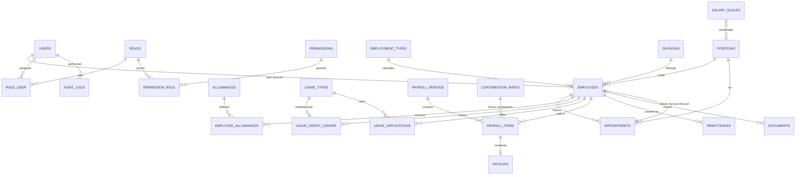

# DICT Regional Office 2 — Employee Management System (HRIS)

**Version:** 1.0 · **Date:** August 4, 2026 · **Status:** Approved blueprint (Phase 1 ready)

---

## 1. Overview

A full-blown Human Resource Information System (HRIS) for DICT Regional Office 2 covering:

- Employee 201-file profiles (Permanent, Temporary, Casual, Co-Terminus, Contractual, JO, COS, GIP, …)
- Appointments & position tracking (Salary Standardization Law grades/steps)
- Leave management per CSC Omnibus Rules (VL/SL accruals, SLP, forced leave, monetization)
- Payroll & payslips with Philippine statutory deductions (GSIS, PhilHealth, PAG-IBIG, BIR)
- Official documents: CSC Service Record, Certificate of Employment, certifications (PDF)
- Contribution remittance reports, headcount reports, full audit trail

**Scale:** 100–500 employees · **Team:** internal DICT developers · **Build:** custom Laravel application.

---

## 2. Tech Stack (locked)

| Layer | Choice | Notes |
|---|---|---|
| Framework | **Laravel 11/12 (PHP 8.2+)** | Team skill set; LTS-style release cadence; huge ecosystem |
| Database | **MySQL 8 / MariaDB 10.11** | Native in XAMPP (dev) and Hostinger (prod); PostgreSQL optional later |
| Frontend | **Blade + Tailwind CSS + Alpine.js** | No build step complexity; **Livewire 3** for interactive forms |
| Auth / RBAC | Laravel Breeze/Fortify + **custom roles & permissions tables** | Admin, HR, Payroll, Unit Head, Employee |
| PDF | **barryvdh/laravel-dompdf** (Phase 3) | Pure PHP — works on XAMPP and VPS, no binaries |
| Audit | **Custom `audit_logs` table** + model observers | Append-only, COA-ready |
| Jobs/Queue | Database queue driver + cron | Monthly accruals, payroll runs, PDF jobs |
| Local dev | **XAMPP** (Apache + MySQL + PHP 8.2) | Matches existing workflow |
| Production | **Hostinger VPS KVM2** — Ubuntu 24.04, Nginx, PHP-FPM, MariaDB, Let's Encrypt | 2 vCPU / 8 GB RAM / 100 GB NVMe — ample headroom |

### Key packages (all free / open source)
- `barryvdh/laravel-dompdf` — PDF generation
- Optional: `livewire/livewire` — interactive UI components
- No other runtime dependencies; RBAC and audit are hand-rolled to keep the app self-contained.

---

## 3. Architecture

- **Single monolith** Laravel application. No microservices at this scale.
- **Domain module folders** under `app/`:
  - `Modules/Employees` · `Modules/Appointments` · `Modules/Leave` · `Modules/Payroll` · `Modules/Contributions` · `Modules/Documents` · `Modules/Reports`
  - (If kept simpler: plain `app/Models`, `app/Http/Controllers` grouped by domain. Chosen during Phase 1.)
- **Config-driven compliance engine:** salary grade tables, BIR tax brackets, GSIS/PhilHealth/PAG-IBIG rates are **data rows** (`contribution_rates`, `salary_scales`), not hardcoded. Annual rate changes = update a row, no redeploy.
- **Effective-dated records:** appointments and salary changes carry `effective_from`/`effective_to`. Retroactive adjustments never corrupt past payroll periods.
- **Append-only ledgers** for leave credits and payroll — history is immutable; corrections are new entries.

---

## 4. Data Model (ERD)

### Table catalog (Phase 1–4)

| Table | Purpose |
|---|---|
| `users`, `roles`, `permissions`, `role_user`, `permission_role` | Authentication + RBAC |
| `employment_types` | Permanent, Temporary, Casual, Co-Terminus, Contractual, JO, COS, GIP — each with entitlement flags (leave, GSIS, premium…) |
| `divisions`, `positions` | Org structure & plantilla |
| `employees` | 201-file profile + current snapshot (grade, step, salary) |
| `appointments` | Chronological appointment history → **auto-generates Service Record** |
| `salary_scales` | SSL grade × step amounts (config data) |
| `allowances`, `employee_allowances` | e.g., PERA; effective-dated per employee |
| `leave_types` | VL, SL, SLP, Maternity, Paternity, Solo Parent, VAWC… with accrual rules |
| `leave_credit_ledger` | Append-only accruals/usage/monetization |
| `leave_applications` | Filing + approval workflow |
| `contribution_rates` | GSIS/PhilHealth/PAG-IBIG/BIR rates as config JSON (brackets, caps) |
| `payroll_periods`, `payroll_items`, `payslips` | Pay runs, per-employee computations (full trace in `computation_json`), PDFs |
| `remittances` | Monthly contribution remittance tracking |
| `documents` | Issued Service Records, COEs, certifications (with reference no + QR later) |
| `audit_logs` | Append-only activity log |
| `employee_educations`, `employee_work_experiences`, `employee_civil_service_eligibilities` | Full 201 file |

---

## 5. Philippine Compliance Engine

### Contributions (research-backed, 2025–2026 rules)
- **GSIS** (RA 8291): employee 9%, government 12% of **basic salary** (PERA exempt — matches the engine's GSIS base); **no salary ceiling**.
- **PhilHealth** (UHC Act): 5% total split 2.5%/2.5%; salary floor ₱10,000 (min premium ₱500 total), ceiling ₱100,000 (max ₱5,000 total).
- **PAG-IBIG** (Circular 460): ≤ ₱1,500 → 1%/2%; > ₱1,500–₱10,000 → 2%/2%; > ₱10,000 → capped ₱200 + ₱200.
- **BIR withholding** (TRAIN Law, current tables): ₱250k exemption; 15%→35% graduated brackets — stored as bracket data.
- All rates live in `contribution_rates` with `effective_from`/`effective_to`, so updates are data changes.

### Leave (CSC Omnibus Rules, MC 41 s. 1998 + amendments)
- VL & SL accrue **1.25 days/month** (cron job on monthly payroll cut-off).
- **SLP**: 3 days/year, non-cumulative, non-commutative.
- **Forced leave**: employees with ≥10 VL credits must take ≥5 working days/year (monitoring report).
- **Monetization**: `(monthly salary ÷ 22) × days`, min 10 days, retain ≥5, max 30/year.
- **Maternity** 60 days · **Paternity** 7 days (first 4 deliveries) · **Solo Parent** 7 days · **VAWC** 10 days.
- **Contractual (no leave as of right):** 20% salary premium instead — handled per `employment_types.requires_20pct_premium`.

### Employee types
| Type | Leave credits | GSIS | 20% premium |
|---|---|---|---|
| Permanent / Temporary / Casual / Co-Terminus | ✅ 1.25/mo | ✅ | — |
| Contractual | ❌ (premium instead) | ✅ | ✅ |
| JO / COS | ❌ | ❌ (pay per service) | — |
| GIP (interns) | ❌ | ❌ | — |

### Documents
- **Service Record**: generated chronologically from `appointments` (CSC format) — critical for retirement/GSIS/transfers.
- **COE**, **Certificate of Leave Balances**, **Certification of No Pending Case** — templated PDFs with reference numbers.
- **Document requests** (`document_requests` table): employees request any requestable document (COE, Service Record, Leave Balances, No Pending Case, DTR); HR fulfills from a queue — issue mints a reference + records the issuance, reject carries a reason. Statuses pending → issued | rejected | canceled.

---

## 6. Deployment

### Local development (XAMPP, Windows)
1. Install XAMPP with **PHP 8.2+** and MySQL.
2. `composer create-project laravel/laravel hris`
3. Copy `database/` + `docs/` from this repo into the project.
4. Configure `.env` (MySQL database `hris`), run `php artisan migrate --seed`.
5. `php artisan serve` → http://localhost:8000

### Production (Hostinger VPS KVM2 — 2 vCPU / 8 GB RAM / 100 GB NVMe)
1. Ubuntu 24.04 + Nginx + PHP 8.2-FPM + MariaDB; UFW + fail2ban.
2. Let's Encrypt SSL; `.env` production values; **OPcache enabled**.
3. **Backups (non-negotiable):** daily `mysqldump` + storage snapshot to off-server location; restore drill tested.
4. Deploy via Git: private repo → `git pull` on server (or Deployer).
5. Queue worker via systemd + cron for scheduler (`php artisan schedule:run`).
6. Base URL on VPN/intranet as needed for remote offices.

### Security checklist
- HTTPS everywhere · strong password policy · role-based access control
- CSRF/XSS protections (Laravel defaults) · rate limiting on auth
- Encrypted sensitive fields where required (DPA/Data Privacy Act of 2012 compliance)
- Regular dependency updates (`composer audit`)

---

## 7. Roadmap

| Phase | Scope | Deliverables |
|---|---|---|
| **1. Foundation** | Auth/RBAC, employment types, divisions/positions, employee profiles | Login, user management, employee CRUD, lists & filters by type ✅ + self-service profile/photos/password ✅ + audit trail viewer ✅ |
| **1.5. UI Redesign** | eGovPay-style design system (dark navy sidebar, blue-600 actions, rounded cards, tracked tables) + mobile responsiveness | Design kit translated to plain CSS/Blade (see `docs/UI_REDESIGN.md`), off-canvas mobile drawer, SVG headcount chart with view toggle, a11y/UX ✅ — on branch `ui-improvements` |
| **2. Leave** | Leave types, monthly accruals, applications, approval workflow, leave cards | Leave module end-to-end ✅ (accruals, filing, approvals, leave cards, ledger integrity) |
| **3. Documents** | Service Record, COE, certifications + appointment history management | Service Record (CSC Form 212) ✅ · Certificate of Employment ✅ · **Appointment Manager** ✅ (HR maintains the effective-dated timeline that drives the Service Record) — all PDFs dompdf-compatible with sequential reference numbers |
| **4. Reports & Audit** | Dashboards, headcount/leave/remittance reports, audit viewer | Reporting suite ✅ — hub + headcount (by type/division/status/fund), leave balances, leave utilization, document issuance log, attrition & onboarding, and a monthly attendance summary (work days, days present, absences, hours, late/undertime, rest-day OT) — every report exports **CSV · Excel · PDF** (`?format=csv|xls|pdf`; SpreadsheetML .xls opens natively in Excel, dompdf landscape PDF with DICT masthead); audit viewer ✅ (Phase 1) |
| **5. Attendance & DTR** | Geofenced time logging, CSC Form 48 DTR, corrections workflow | **Geofenced attendance ✅** — admin/HR plot checkpoints on a Leaflet/OSM map (HQ + provincial offices); punches accepted only when the device GPS is inside a checkpoint radius (server-side haversine check) · **CSC Form 48 DTR ✅** — auto-generated monthly grid with late/undertime/hours, HTML preview + PDF with DTR- reference numbers · **Correction workflow ✅** — logs are append-only; every alteration is a request reviewed/approved by HR · **HR timelog browser + manual entries ✅** · **Flexible scheduling ✅ (AOM 2026-020)** — effective-dated work-schedule registry (4-Day CWW Mon–Thu 7–6 seeded, Standard Mon–Fri 8–5) with per-day-of-week work/rest + times, holiday calendar with the CSC 2600838 Friday-revert rule (holiday on a weekday rest day reverts the whole week), and rest-day/holiday punches still counted as overtime (CTO-eligible) · 🚧 Imports/notifications pending |
| **3.6. Notifications** | In-system inbox, email, SMS via Android gateway | **Inbox ✅** — topbar bell + `/notifications` (unread badge, mark read, mark all) · **Email ✅** — via Laravel mailer on every notification · **SMS ✅** — queued async delivery to the capcom6 Android gateway (`sms:send` cron, retries ≤ 3, soft-fail) · Fires on document request/issue/reject + leave file/approve/reject |
| **6. Payroll** | Salary scales, contribution engine, payroll runs, payslips | **Payroll module ✅** — config-driven contribution/tax engine (GSIS 9%/12%, PhilHealth 5% with ₱500–₱5,000 premium floor/cap, PAG-IBIG 2%/2% capped at ₱200, BIR TRAIN brackets annualized), payroll periods with a draft → generated → finalized → remitted lifecycle, per-employee items with the **full computation trace persisted** (`computation_json`), dompdf payslips (`PS-YYYY-NNNN`) with DICT letterhead, per-agency remittance register (pending → remitted), **per-item adjustments ✅** (honoraria / overtime / other income + LWOP / other deductions — recompute with the engine, trace re-persisted, preserved across period recomputes, draft-only), and employee **self-service payslips** (`/my/payslips`). Scheduled last by decision (Aug 2026) so the data backbone was solid first. Known limit: salary scales remain the seeded placeholders pending the official SSL table |

---

## 8. Risks & Mitigations

| Risk | Mitigation |
|---|---|
| Payroll calculation errors | Config-driven rates + `computation_json` trace on every payslip + test fixtures with known BIR/GSIS cases |
| Data loss | Daily automated backups + restore drills |
| Audit compliance | Append-only ledgers, `audit_logs`, effective-dated records |
| Team bus factor | Single Laravel codebase, clear module boundaries, documented conventions |
| Scope creep | Phased roadmap; each phase ships something usable |

---

## 9. Status & immediate next step

**Phase 1 – Foundation: ✅ complete.** Auth/RBAC, employee 201-file module with real DICT RO2 directory,
self-service (My Profile, photos, password), audit trail viewer — shipped, tested (19/19).

**UI redesign: ✅ complete — on branch `ui-improvements`.** The earlier GOV.PH Institutional pass was
replaced by an **eGovPay-style design system** (see `docs/UI_REDESIGN.md`): dark navy sidebar
(`#1B2A4A`), blue-600 primary actions, light-gray canvas, white rounded cards, pill badges,
tracked uppercase table headers, Inter + Be Vietnam Pro type, circular deterministic avatars, a
rebuilt dashboard (hero banner, stat-row panel, vanilla-SVG headcount chart with table/area/bar
view toggle), and a lighter navy than the original kit — all implemented in plain CSS + vanilla
JS (no build step) and pushed to `origin/ui-improvements`.

**Phase 2 – Leave: ✅ complete.** Accruals (`leave:accrue`, idempotent month-keyed),
filing with working-day computation and insufficient-balance guard, approval workflow
(ledger debit on approve, reason on reject), leave cards, full audit trail.

**Phase 3 – Documents: ✅ complete.** The **Appointment Manager** (`/employees/{id}/appointments`
create · `/appointments/{id}` edit/delete, admin/HR only) lets HR grow each employee's
chronological, effective-dated appointment history — promotions, transfers, re-appointments,
step increments — and every change re-syncs the employee's current-position snapshot. That
timeline drives the **CSC Service Record (CS Form 212)** and the **Certificate of Employment**,
both rendered as dompdf-safe PDFs (table-only layout, no flexbox/transforms) with sequential
reference numbers (`SR-2026-0001`, `COE-2026-0001`) recorded in `documents`.

**Phase 4 – Reports & Audit: ✅ complete.** A `/reports` hub (admin/HR) with six
reports over the live data — headcount (groupable by employment type / division / status /
source of fund, with a status filter), VL/SL leave balances (single grouped ledger query),
leave utilization (approved days per type per year), documents issued (Service Records &
COEs with reference numbers), attrition & onboarding (separations/new hires per year), and
a new **Attendance Summary** (`/reports/attendance-summary`): a monthly per-employee roll-up
of scheduled work days, days present, absences, total hours rendered, late/undertime minutes,
and rest-day/weekend/holiday hours (the CTO evidence), with month/year/division filters and
a totals row — computed against the AOM 2026-020 schedule via a batched single-pass builder
(`App\Support\AttendanceSummary`) that resolves the per-day schedule once and reuses it for
every employee. Every report now exports in **CSV · Excel · PDF**: CSV stays UTF-8 BOM with
`fputcsv` quoting + formula-injection guard, Excel is generated as SpreadsheetML 2003 XML
(`.xls`, opens natively in Excel/LibreOffice, string cells guarded against `= + - @` formula
injection, numeric cells typed Number), and PDF is a dompdf landscape A4 table with the DICT
masthead and generated-by/timestamp footer. Known limitation: separation dates derive from
`updated_at` (no dedicated column yet).

**Phase 5 – Attendance & DTR: ✅ core complete.** Geofenced time logging with map-plotted
checkpoints (Leaflet + OpenStreetMap; server-side radius validation), CSC Form 48 Daily
Time Records (auto-generated monthly grid — hours, late, undertime — as HTML + PDF with
`DTR-2026-XXXX` reference numbers), and a corrections workflow where every punch alteration
is an employee request approved/rejected by HR (logs stay append-only; HR also has a manual
entry path for field duty/forgotten punches). Seeded checkpoints cover HQ + the 5 provincial
offices.

**Phase 5.2 – Flexible work scheduling: ✅ complete (AOM No. 2026-020).** Attendance
Settings grew from a single flat office-hours block into an **effective-dated work-schedule
registry** (`work_schedules` + `holidays`): HR defines named schedules with per-day-of-week
work/rest flags and AM/PM times, effective from/to dates, and a revert target. Seeded from
the AOM: the **4-Day Compressed Workweek** (Mon–Thu 7:00 AM–6:00 PM, Friday rest day,
effective 03 Aug 2026) and the **Standard 8-Hour** Mon–Fri schedule it reverts to. The
**CSC Resolution No. 2600838 rules** in the memo are enforced: a holiday/work suspension on
a weekday rest day (Friday) reverts that whole week to the standard 8-hour schedule, while
a holiday on a working day is flagged as deemed-complied. The DTR resolves the schedule per
day, marks rest days and holidays, and still counts hours rendered on them as
**overtime (CTO-eligible)** — punches are never blocked because rest-day/holiday timelogs
are the evidence for CTO credit claims. Fixed-date national holidays (recurring yearly) are
seeded; HR manages the calendar in Settings.

**Phase 3.5 – Document requests: ✅ complete.** Employees request official documents
from **My Documents** (`/documents/requests`): Certificate of Employment, Service Record,
Certificate of Leave Balances (live ledger balances as of issuance),
Certification of No Pending Case, or DTR (per month). HR works a **fulfillment
queue** (`/documents/requests/queue`, admin/HR) with status filters — **Issue**
mints the reference number (`COE-`/`SR-`/`LB-`/`NPC-`/`DTR-YYYY-NNNN`),
generates the PDF, and records the issuance in `documents`; **Reject** requires
a reason. Employees track status (pending/issued/rejected/canceled), cancel
pending requests, and download issued PDFs (regenerated deterministically with
their reference). Duplicate pending requests are blocked; every step is audited.
The documents-issued report now filters all document types.

**Phase 6 – Payroll: ✅ complete.** A `Payroll` computation engine
(`app/Support/Payroll.php`) turns each employee's monthly salary + active PERA
allowances into a full run using **effective-dated rate rows** from
`contribution_rates`: GSIS 9%/12% on basic salary, PhilHealth 5% premium
(₱500 floor / ₱5,000 cap, split 50/50), PAG-IBIG 2%/2% on the capped base
(employee share ≤ ₱200), and BIR TRAIN brackets annualized (PERA exempt).
Every computation carries a **full trace** (bases, rates, brackets) persisted
in `payroll_items.computation_json` so payslips stay auditable years later.
The `/payroll` module (admin/HR/payroll) manages periods — create (duplicate
dates rejected) → **Compute Payroll** (one item per active employee) →
**Finalize & Issue Payslips** (locks the period, issues a `PS-YYYY-NNNN`
payslip per item, and generates the GSIS/PhilHealth/PAG-IBIG/BIR remittance
summaries) — plus a remittance register (mark remitted with OR/reference no.)
and dompdf-safe payslip PDFs with the DICT letterhead and computation-trace
table. Every employee can open **My Payslips** (`/my/payslips`) to view their
own finalized payslips. Payroll role sees the module but not the audit trail.
Per-item **adjustments** are entered from any draft period's item rows
(`/payroll/items/{id}/adjust`): honoraria, overtime pay, other income
(taxable additions) plus LWOP / other deductions. Saving recomputes the
item through the full engine — GSIS/PhilHealth/PAG-IBIG/BIR all refresh,
the `computation_json` trace is re-persisted (with the manual lines), and
the change is audited. Recomputed periods **preserve** the manual entries
(they ride along with each employee's item). Locked periods refuse
adjustments with a 409. Known limit: `salary_scales` still holds the
sample placeholder amounts pending the official SSL table.

**Notifications — ✅ complete (stretch of Phase 5, done).** Every employee has an
**in-system inbox** (`/notifications`, topbar bell with unread badge, mark-as-read /
mark-all-read). The same events fire **email** via Laravel's mailer and **SMS**
through the self-hosted **Android SMS gateway** (`Reference/sms.md` — `POST
{url}{path}` with Basic auth, E.164 normalization, messages enqueued to `sms_queue`
and delivered asynchronously by `php artisan sms:send`, scheduled every minute,
retries ≤ 3 attempts). Fires on: document request submitted (HR/admin), document
issued/rejected (employee), leave filed (HR/admin), leave approved/rejected
(employee). Delivery is **soft-fail** — a broken SMTP or gateway is logged, never
blocks the business action. SMS only sends when `SMS_ENABLED=true` and the
employee has a contact number on their 201-file. Remaining stretch in Phase 5:
spreadsheet imports.
