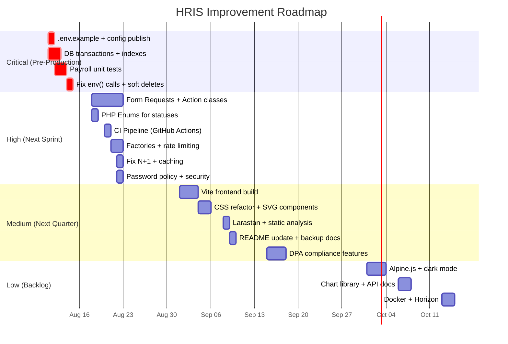

# DICT RO2 HRIS — Application Audit & Improvement Plan

> **Audited:** 2026-08-10
> **Branch:** `ui-improvements`
> **Stack:** Laravel 12 (PHP 8.2+), Blade, vanilla CSS/JS, MySQL 8, dompdf, php-qrcode, phpspreadsheet

---

## Table of Contents

1. [Executive Summary](#1-executive-summary)
2. [Current Architecture Overview](#2-current-architecture-overview)
3. [Findings by Category](#3-findings-by-category)
   - 3.1 [Security](#31-security)
   - 3.2 [Architecture & Code Quality](#32-architecture--code-quality)
   - 3.3 [Frontend & UI](#33-frontend--ui)
   - 3.4 [Database & Data Integrity](#34-database--data-integrity)
   - 3.5 [Testing](#35-testing)
   - 3.6 [Performance & Scalability](#36-performance--scalability)
   - 3.7 [DevOps & Deployment](#37-devops--deployment)
   - 3.8 [Documentation & Maintainability](#38-documentation--maintainability)
4. [Prioritized Recommendations](#4-prioritized-recommendations)
5. [Implementation Roadmap](#5-implementation-roadmap)
6. [Quick Wins (Do This Week)](#6-quick-wins-do-this-week)

---

## 1. Executive Summary

The DICT RO2 HRIS is a well-structured Laravel 12 application covering employee management, leave (CSC-compliant), payroll with Philippine statutory deductions, attendance with geofencing, official document generation (COE, Service Record, DTR), notifications with SMS, and audit trails. The domain modeling is strong — append-only ledgers, effective-dated rates, auditable payroll traces, and QR-verified documents show real care.

**Overall code quality: 7/10.** The backend is solid. The main gaps are in **security hardening** (missing Form Requests, mass assignment surface, no password policy), **frontend architecture** (no build tooling, monolithic CSS), **testing coverage** (no unit tests for payroll/leave logic), and **deployment readiness** (no CI/CD, no `.env.example`, no Docker).

---

## 2. Current Architecture Overview

```
app/
├── Http/Controllers/     18 controllers (thin-to-medium, well-commented)
├── Models/               30 Eloquent models
├── Support/              10 service classes (Payroll engine, Audit, DTR, SMS, Notifier, etc.)
├── Notifications/        8 notification classes + custom SMS channel
├── Console/Commands/     2 scheduled commands (leave accrual, SMS queue)
├── Middleware/           RoleMiddleware (RBAC guard)

resources/views/          75 Blade templates
public/css/app.css        ~46 KB monolithic vanilla CSS (no build step)
public/js/app.js          ~18 KB vanilla JS

database/migrations/      30 migrations
database/seeders/         11 seeders
tests/Feature/            16 feature tests (smoke/integration level)
```

**Key design patterns observed (positive):**
- Append-only leave credit ledger (double-entry style: credit/debit columns)
- Append-only audit log with old/new value diffs
- Effective-dated contribution rates (statutory payroll config as data)
- Geofenced attendance with server-side GPS validation
- Notification system that never blocks business actions (fail-safe design)
- QR-verified documents with public verification endpoint
- Preview-then-commit bulk imports

---

## 3. Findings by Category

### 3.1 Security

| # | Finding | Severity | Details |
|---|---------|----------|---------|
| S1 | **No Form Request classes** | Medium | All validation lives inline in controllers (`$request->validate([...])`). Reusing validation rules across create/update requires copy-paste. No centralized authorization policies. |
| S2 | **Mass assignment on update without explicit fillable checks** | Medium | `Employee::update($data)` relies on `$fillable` but `$data` is directly from validated input which may include unexpected keys if validation rules drift. |
| S3 | **No password complexity policy** | Medium | Profile password change only enforces `min:8`. No requirement for mixed case, numbers, or symbols. CSC/DPA-sensitive system should enforce stronger passwords. |
| S4 | **No rate limiting on sensitive POST routes** | Medium | Leave filing, document requests, attendance punches, payroll actions have no per-user rate limiting. Only login and document verification are throttled. |
| S5 | **No CSRF protection verification on AJAX** | Low | CSRF token is in the meta tag but JS fetch calls need to verify it's being attached to all POST requests. |
| S6 | **SQL `LIKE` with raw user input** | Low | Employee search uses `"%{$search}%"` directly in LIKE clauses. While Laravel's query builder parameterizes this, special characters like `%` and `_` in search input are not escaped, enabling wildcard injection. |
| S7 | **No account lockout after failed attempts** | Medium | Login is throttled at 5 req/min globally, but there's no progressive lockout or per-account lockout policy. |
| S8 | **`env()` calls inside service classes** | Low | `Sms.php` and other classes call `env()` directly as fallbacks. In production with `php artisan config:cache`, `env()` returns null. Config should come from `config/services.php` only. |
| S9 | **No security headers middleware** | Low | No CSP, X-Frame-Options, X-Content-Type-Options, or HSTS headers are set. |
| S10 | **No session security hardening** | Low | Session config not visible (no `config/` directory published). Default Laravel session settings may need `secure`, `httponly`, and `samesite` tuning. |
| S11 | **GPDR/DPA compliance gap** | Medium | No data retention policy, no right-to-erasure mechanism, no consent management. Philippine Data Privacy Act requires explicit safeguards. |

### 3.2 Architecture & Code Quality

| # | Finding | Severity | Details |
|---|---------|----------|---------|
| A1 | **Fat controllers** | Medium | Controllers like `LeaveController` (~250+ lines), `PayrollController` (~300+ lines), `ImportController` (~400+ lines) contain business logic that belongs in service classes. Leave approval workflow, payroll computation orchestration, and import validation should be extracted. |
| A2 | **No service layer pattern** | Medium | `app/Support/` has utility classes but no proper service layer for business operations. Controllers directly call models + support classes. An `Actions/` directory (e.g., `ApproveLeave`, `IssueDocument`, `FinalizePayroll`) would improve testability. |
| A3 | **No Eloquent API Resources** | Low | JSON responses (attendance punch, corrections) are manually formatted. API Resources would standardize this. |
| A4 | **Status strings as magic values** | Medium | Statuses like `'pending'`, `'approved'`, `'rejected'`, `'issued'`, `'draft'`, `'finalized'` are hardcoded strings scattered across controllers and Blade views. Some models have `const` definitions (e.g., `DocumentRequest::STATUS_PENDING`) but not all. `LeaveApplication`, `PayrollPeriod`, `PayrollItem` use bare strings. |
| A5 | **No enums for status fields** | Medium | PHP 8.1+ enums would eliminate typos and centralize status logic. E.g., `LeaveStatus::Pending`, `PayrollStatus::Draft`. |
| A6 | **Inconsistent model structure** | Low | Some models use explicit relation types (`BelongsTo`), others don't. Some have `casts()` method, others use `$casts` property. Minor inconsistency. |
| A7 | **Duplicated validation rules** | Medium | `EmployeeController::validateEmployee()` is a private method (good), but other validation patterns are repeated. Form Requests would solve this. |
| A8 | **No repository pattern for complex queries** | Low | Complex queries (leave balances, payroll computation, report aggregates) are inline. Not necessarily wrong for this project size, but limits testability. |
| A9 | **`config/` directory not published** | Medium | No published config files. The app relies entirely on framework defaults. Missing `config/services.php` for SMS config, no custom session/cache config. |
| A10 | **No `.env.example` file** | High | New developers cannot set up the project. Required env vars (SMS_*, DB_*, etc.) are undocumented. |

### 3.3 Frontend & UI

| # | Finding | Severity | Details |
|---|---------|----------|---------|
| F1 | **No frontend build tooling** | Medium | No Vite, no Tailwind config, no PostCSS. CSS is a single ~46 KB hand-written file. This means no minification, no autoprefixing, no purge of unused styles. The README mentions Tailwind + Alpine.js + Livewire but none are installed. |
| F2 | **Monolithic CSS file** | Low | `public/css/app.css` at ~46 KB handles everything. Should be split into component files and built/concatenated. |
| F3 | **Inline SVGs in Blade** | Low | Dashboard and layout have large inline SVG blocks repeated. These should be extracted into a Blade component or icon partial. |
| F4 | **No JavaScript framework** | Low | Vanilla JS in `public/js/app.js` (~18 KB). For the current feature set this is adequate, but interactive features (attendance punch, chart toggles) could benefit from Alpine.js for cleaner reactivity. |
| F5 | **No dark mode support** | Low | The CSS uses CSS custom properties which could enable dark mode, but it's not implemented. |
| F6 | **Google Fonts loaded externally** | Low | Inter + Be Vietnam Pro loaded from Google Fonts CDN. For a government system with potential offline/intranet deployment, fonts should be self-hosted. |
| F7 | **Chart implementation** | Medium | Dashboard chart is custom vanilla JS with no charting library. Limited chart types, no responsive resize handling evident. |
| F8 | **Accessibility** | Low | Basic accessibility is present (skip link, ARIA labels on nav, aria-expanded on nav groups). Could improve with keyboard navigation testing and screen reader optimization. |

### 3.4 Database & Data Integrity

| # | Finding | Severity | Details |
|---|---------|----------|---------|
| D1 | **No database foreign key constraints in migrations** | Medium | Migrations create tables but need verification that all FK constraints are defined. ORM-level relations exist but DB-level enforcement is the safety net. |
| D2 | **No database indexes beyond PK** | Medium | Search on `employee_number`, `first_name`, `last_name` with LIKE queries. Leave application filtering by status/date. These columns likely need indexes for production data volume. |
| D3 | **No check constraints** | Low | Status fields are VARCHAR with no DB-level CHECK constraints. Application-level validation is the only guard. |
| D4 | **Soft deletes not used** | Low | Employee deletion is hard delete (after checking for appointments). Government records typically need soft deletes or archival instead of permanent deletion. |
| D5 | **No database transactions on critical multi-step operations** | Medium | `DocumentRequestController::issue()` creates a Document + updates the request + sends notifications. While the retry loop handles reference number collision, the full operation isn't wrapped in a DB transaction. Leave approval debits the ledger + updates application — should be transactional. |
| D6 | **Reference number generation race condition** | Medium | `DocumentIssuer::nextReferenceNo()` reads the max reference number and increments. Under concurrent requests, two issuances could generate the same number. The `Document::create()` unique constraint + retry loop mitigates this, but a sequence table or `LOCK` would be cleaner. |

### 3.5 Testing

| # | Finding | Severity | Details |
|---|---------|----------|---------|
| T1 | **No unit tests for critical business logic** | High | The payroll computation engine (`Payroll::compute()`), leave accrual logic, and leave balance calculations have no dedicated unit tests. These are the most error-prone, compliance-critical parts of the system. |
| T2 | **Feature tests are integration-level** | Medium | The 16 feature tests cover end-to-end flows (good), but don't isolate edge cases in computation logic. GSIS/PhilHealth/PAG-IBIG/BIR calculations need parametric test coverage with known expected values. |
| T3 | **No test factories** | Medium | No `database/factories/` directory visible. Tests likely create models manually, leading to brittle test setup. Factory generation would make tests cleaner and more maintainable. |
| T4 | **No CI/CD pipeline** | High | No GitHub Actions, GitLab CI, or similar. Tests must be run manually. No automated quality gates before merge. |
| T5 | **No static analysis** | Medium | Larastan/Psalm not configured. Type safety beyond PHP's runtime checks is absent. |
| T6 | **Pest is configured but unused** | Low | `composer.json` allows `pestphp/pest-plugin`, but tests use PHPUnit base class. Should standardize on one. |

### 3.6 Performance & Scalability

| # | Finding | Severity | Details |
|---|---------|----------|---------|
| P1 | **N+1 query potential** | Medium | `Employee::leaveBalances()` loops over all leave types and runs a separate SUM query per type. On the employee profile page, this fires N queries. Should use a single grouped query (as done in `ReportController::leaveBalances()`). |
| P2 | **Dashboard counts are uncached** | Low | `DashboardController::index()` runs 4 separate COUNT queries on every page load. For a dashboard, these should be cached (even 60-second cache would help). |
| P3 | **Attendance checkpoint proximity check** | Low | `AttendanceController::punch()` loads ALL active checkpoints into memory and computes distance in PHP. For a small number of checkpoints this is fine, but it doesn't scale. SQL spatial queries or bounding-box pre-filtering would help at scale. |
| P4 | **No query caching** | Low | Contribution rates, leave types, employment types, and divisions are reference data fetched repeatedly. These should be cached with `Cache::remember()`. |
| P5 | **No eager loading on some list pages** | Low | Need to verify all list pages use eager loading to avoid N+1. The employee list does (`->with(['employmentType', 'position', 'division'])`). |
| P6 | **SMS queue processed synchronously per job** | Low | `sms:send --limit=50` processes one at a time. For higher volume, batch/concurrent processing or a proper queue worker (Redis/Horizon) would be better. |

### 3.7 DevOps & Deployment

| # | Finding | Severity | Details |
|---|---------|----------|---------|
| V1 | **No `.env.example`** | High | Critical for onboarding. The project cannot be set up by a new developer without guessing env vars. |
| V2 | **No Docker/containerization** | Medium | No `Dockerfile`, `docker-compose.yml`, or Laravel Sail configuration published. Deployment method is unclear (XAMPP mentioned in README). |
| V3 | **No CI/CD pipeline** | High | No automated testing or deployment. Risk of deploying broken code. |
| V4 | **No health check endpoint beyond `/up`** | Low | Laravel's built-in `/up` exists. Could add custom health checks (DB, SMS gateway, storage). |
| V5 | **No backup strategy documented** | Medium | Government HR data needs documented backup procedures. No backup scripts or documentation. |
| V6 | **`scripts/setup.sh` referenced in README but not present** | Medium | README references `scripts/setup.sh` but the file doesn't exist in the repo. |
| V7 | **Composer `setup` script exists but no equivalent for production** | Low | `composer setup` handles dev setup. No documented production deployment steps. |

### 3.8 Documentation & Maintainability

| # | Finding | Severity | Details |
|---|---------|----------|---------|
| M1 | **README is outdated** | Medium | README mentions "Phase 1 application + data layer + blueprint" but the app is clearly through Phase 6. Mentions Tailwind/Alpine/Livewire which aren't installed. References `scripts/setup.sh` which doesn't exist. |
| M2 | **`docs/PLAN.md` is 32KB** | Low | Large monolithic planning doc. Should be split into architecture, API, and roadmap docs. |
| M3 | **Inline code comments are excellent** | Positive | Controllers and support classes have thorough, domain-aware comments explaining CSC rules, business logic, and design decisions. This is a major strength. |
| M4 | **No API documentation** | Low | The attendance punch endpoint and correction endpoints are JSON/AJAX but undocumented. No OpenAPI/Swagger spec. |
| M5 | **No CHANGELOG** | Low | No structured changelog. Git history is the only record of changes. |

---

## 4. Prioritized Recommendations

### Priority 1: Critical (Address Before Production)

| Rec | Effort | Impact |
|-----|--------|--------|
| Create `.env.example` with all required variables | 1h | Unblocks onboarding & deployment |
| Add DB transactions to multi-step operations (leave approval, document issuance, payroll finalize) | 4h | Prevents data corruption |
| Add database indexes on search/filter columns | 2h | Query performance at scale |
| Write unit tests for `Payroll::compute()` with known statutory values | 1d | Compliance correctness guarantee |
| Publish `config/` files and move `env()` calls to config | 2h | Prevents production config failures |
| Add soft deletes to Employee model + migration | 2h | Data retention compliance |
| Fix `env()` calls in `Sms.php` (breaks under `config:cache`) | 1h | Prevents SMS failures in production |

### Priority 2: High (Address in Next Sprint)

| Rec | Effort | Impact | Status |
|-----|--------|--------|--------|
| ~~Extract Form Request classes for all POST routes~~ | 1d | Cleaner validation, reusable rules | ✅ Done (26 classes) |
| Create action/service classes for business operations | 2d | Testability, separation of concerns | Pending |
| ~~Use PHP enums for all status fields~~ | 4h | Eliminates magic strings, typo-proof | ✅ Done (3 enums) |
| ~~Set up CI pipeline (GitHub Actions: lint + test)~~ | 4h | Automated quality gate | ✅ Done |
| ~~Add database factories for all models~~ | 1d | Faster, more reliable test setup | ✅ Done (17 factories) |
| ~~Add rate limiting to sensitive POST routes~~ | 2h | Abuse prevention | ✅ Done |
| ~~Add password complexity policy~~ | 2h | Security hardening | ✅ Done |
| ~~Fix N+1 in `Employee::leaveBalances()`~~ | 2h | Performance on profile pages | ✅ Done |
| ~~Cache dashboard counts and reference data~~ | 2h | Reduced DB load | ✅ Done |
| ~~Add foreign key constraints to all migrations~~ | 3h | DB-level data integrity | ✅ Verified (already present) |

### Priority 3: Medium (Address in Next Quarter)

| Rec | Effort | Impact | Status |
|-----|--------|--------|--------|
| Introduce Vite for frontend asset building | 1d | Minification, autoprefixing, purging | Pending |
| Split monolithic CSS into component files | 1d | Maintainability | Pending |
| Extract inline SVGs into reusable Blade components | 4h | DRY, consistency | Pending |
| ~~Self-host Google Fonts~~ | 1h | Offline/intranet readiness | ✅ Done (11 TTF files) |
| Add Larastan static analysis | 4h | Type safety, early bug detection | Pending |
| ~~Update README to reflect actual state~~ | 2h | Accurate documentation | ✅ Done |
| Add data retention / right-to-erasure mechanisms | 2d | DPA compliance | Pending |
| ~~Add security headers middleware~~ | 2h | Hardening | ✅ Done (SecurityHeaders) |
| ~~Add session security config~~ | 1h | Hardening | ✅ Done (secure, httponly, samesite) |
| ~~Document backup and deployment procedures~~ | 4h | Operational readiness | ✅ Done (docs/BACKUP_AND_DEPLOYMENT.md) |

### Priority 4: Low (Backlog / Nice to Have)

| Rec | Effort | Impact |
|-----|--------|--------|
| Add Alpine.js for lightweight reactivity | 1d | Cleaner interactive UI |
| Implement dark mode | 1d | User preference |
| Add charting library (Chart.js / ApexCharts) | 4h | Richer data visualization |
| Add OpenAPI documentation for JSON endpoints | 1d | API discoverability |
| Add Docker/compose for dev environment | 1d | Consistent dev environments |
| Add Laravel Horizon for queue monitoring | 4h | SMS queue observability |
| Add soft cascade delete policies | 1d | Referential integrity |
| Add database CHECK constraints | 2h | DB-level validation | ✅ Done (11 constraints) |
| Split `docs/PLAN.md` into focused docs | 4h | Navigability |
| Add CHANGELOG.md | Ongoing | Change tracking | ✅ Done |
| ~~Add account lockout policy~~ | 4h | Brute force protection | ✅ Done (5 attempts / 15 min lockout) |
| Escape LIKE wildcards in search queries | 1h | Query accuracy | ✅ Done (Search::escape) |

---

## 5. Implementation Roadmap



---

## 6. Quick Wins (Do This Week)

These are small, high-impact items that can be done immediately:

1. **Create `.env.example`** — Document every env var the app needs (DB, SMS, mail, etc.)
2. **Fix `env()` calls in `Sms.php`** — Move to `config/services.php` so `config:cache` doesn't break SMS
3. **Add DB indexes** — Index `employees.employee_number`, `employees.last_name`, `employees.status`, `leave_applications.status`, `attendance_logs.employee_id + log_date`
4. **Wrap leave approval in a transaction** — `DB::transaction()` around the ledger debit + application status update
5. **Add `Cache::remember()` to dashboard counts** — 60-second TTL is enough
6. **Fix N+1 in `Employee::leaveBalances()`** — Use a single grouped ledger query like `ReportController` already does
7. **Add password complexity rule** — Change `Password::min(8)` to `Password::min(8)->mixedCase()->numbers()->symbols()` in `ProfileController::updatePassword()`
8. **Update README** — Remove Phase 1 language, remove mentions of Tailwind/Livewire, add actual setup steps

---

*This document should be reviewed and updated as improvements are implemented.*
